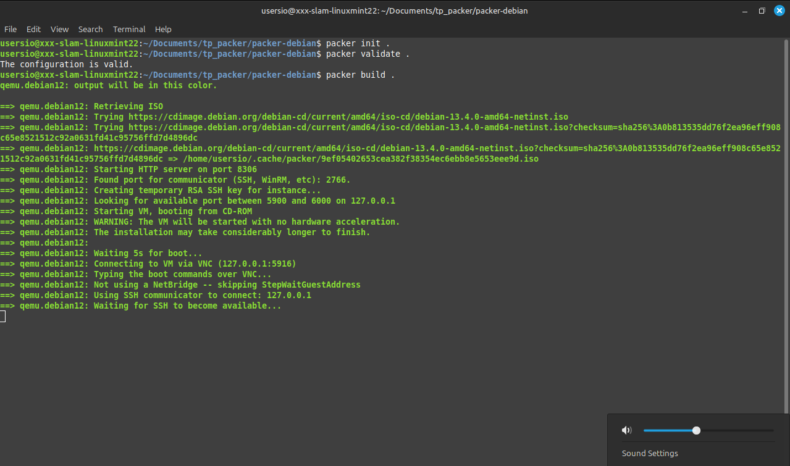
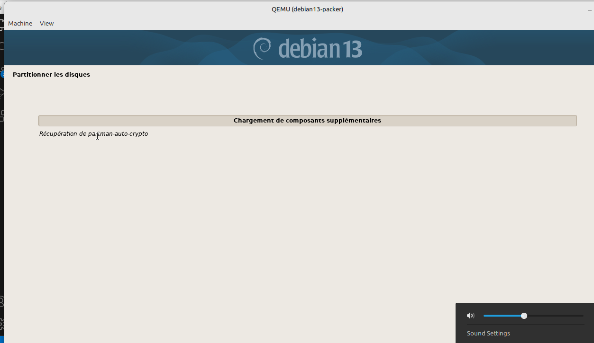

## TP Packer 

#### <u>1.1 - Qu'est-ce que Packer ?</u>

HashiCorp Packer est un outil qui automatise la création d’artefacts (images machines) prêtes à être utilisées : images de VM, AMI AWS, images Docker, etc. 

Il appartient à la famille des outils d'IAAS / automatisation DevOps. Concrètement, il résout le problème de la création manuelle, lente et non reproductible de serveurs en permettant de décrire une image une fois dans un fichier de configuration, puis de générer la même image, de façon identique, pour plusieurs plateformes.

#### <u>1.2 - Le concept d'image immuable</u>

Une image immuable est une image de VM ou de conteneur qui n’est jamais modifiée après sa création : si un changement est nécessaire, on génère une nouvelle image plutôt que de modifier celle en production. Cette approche est considérée comme une bonne pratique car elle évite des accidents en garantissant la cohérence entre environnements et en facilitant les déploiements reproductibles. Par exemple, un incident de production aurait pu être évité si un administrateur n’avait pas modifié manuellement un serveur en prod, créant un comportement différent de la préproduction : avec une image immuable, la modification aurait nécessité une nouvelle image testée avant déploiement.

#### <u>1.3 - Cas d'usage de Packer</u>

| Scénario | Packer ? | Justification |
|---------|----------|---------------|
| Standardiser une image de base pour toute une équipe de développeurs | **O** | Packer crée des images reproductibles et standardisées pour tous les environnements. |
| Démarrer rapidement une VM de test et l’arrêter après utilisation | **N** | Cela relève de l’orchestration ou du cloud provisioning, pas de la création d’images. |
| Générer une AMI AWS prête à l’emploi pour un déploiement cloud | **O** | Packer est conçu pour construire automatiquement des AMI et autres images cloud. |
| Configurer dynamiquement une VM en cours d’exécution | **N** | Packer configure uniquement lors de la création de l’image, pas après le déploiement. D'où le principe d'image immuable. |
| Reproduire identiquement un environnement de CI/CD sur plusieurs machines | **O** | Une image immuable garantit que chaque machine CI/CD démarre avec la même configuration. |

---

## Etape 2 - Installation et vérification

Je vais travailler dans le WSL de mon OS Windows, je serais donc sous Linux.

On va sur la documentation officielle de hashicorp pour installer son packer : https://developer.hashicorp.com/packer/install

```bash
wget -O - https://apt.releases.hashicorp.com/gpg | sudo gpg --dearmor -o /usr/share/keyrings/hashicorp-archive-keyring.gpg
echo "deb [arch=$(dpkg --print-architecture) signed-by=/usr/share/keyrings/hashicorp-archive-keyring.gpg] https://apt.releases.hashicorp.com $(grep -oP '(?<=UBUNTU_CODENAME=).*' /etc/os-release || lsb_release -cs) main" | sudo tee /etc/apt/sources.list.d/hashicorp.list
sudo apt update && sudo apt install packer
```

#### Vérification version 

```bash
tp_packer$ packer --version
Packer v1.15.0
tp_packer$ 
```

## Etape 3 - Build d'une image Debian 12
### 3.3 - Preseed

Aller sur https://preseed.debian.net/debian-preseed/

Je choisit de suivre la documentation de BookWorm qui est un seed de Debian 12.

Comme je comprends pas tout je vais prendre le fichier seed proposé sur : https://wiki.debian.org/DebianInstaller/Preseed

Ce fichier là : https://www.debian.org/releases/stable/example-preseed.txt

Il montre bien les bases à avoir.

J'en génère donc un par IA et je l'adapte en vérifiant bien ce qui est nécessaire

### 3.4 - Script de post-installation

```sh
#!/bin/bash

cd packer-debian/

# 1. Initialiser les plugins (lit le fichier .pkr.hcl et télécharge les plugins nécessaires)
packer init .

# 2. Valider la syntaxe du template
packer validate .

# 3. Lancer le build (15 à 25 minutes selon ta machine)
packer build .

# 4. Vérifier que la box a bien été générée
ls -lh *.box

# 5. Enregistrer la box dans Vagrant
vagrant box add aukfood/debian12 debian12-base.box
vagrant box list

# 6. Tester la box dans Vagrant
mkdir test-box && cd test-box
vagrant init aukfood/debian12
vagrant up
vagrant ssh
```

Pour clarifier j'ai commencé le TP dans le WSL de mon PC d'entreprise car je voulais un environnement Linux parce qu'apparament c'est optimal, après plusieurs heures je me rends comptes que WSL ne supporte pas virtualbox, j'essaie QEMU et c'est la même chose, en fait WSL ne peut juste pas virtualiser.

Donc je repasse sur la partition Windows de mon PC mais je ne peux rien faire car comme c'est un PC d'entreprise, pour faire des modifications il faut l'autorisation de l'dmin normal quoi donc pas mal de tmps perdu. Je quitte les premières 7 heures sur ça.

Finalement le Vendredi matin prochain, je trouve la solution de faire la création de l'image sur une iso d'ubuntu elle même lancée dans VmWare Workstation Player sur le PC de l'école. 

### 3.5 - Build et validation

Capture d'écran des logs de la création de l'image Debian.



Capture d'écran de l'image Debian consomée.


